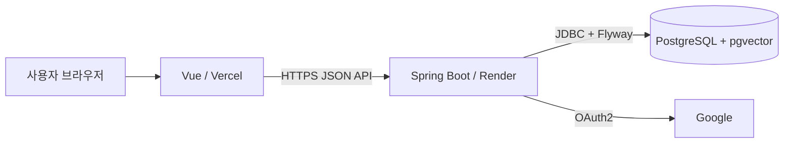

# Click HUB MVP1 통합 실행계획

- 기준일: 2026-09-04
- 기준 브랜치: `origin/develop` (`9e45b6a`)
- 작업 브랜치: `feature/mvp1-integration`
- 작업 방식: 단독 개발, 기능 단위 커밋과 단계별 검증

## 1. 목표와 완료 기준

Vue Frontend, Spring Boot Backend, PostgreSQL을 실제 API와 환경변수 계약으로 연결한다. 로컬 Docker Compose에서 조회와 쓰기 결과가 DB에 저장되고 재시작 뒤에도 유지되는지 검증한 후, 같은 이미지를 Vercel과 Render에 배포할 수 있게 준비한다.

MVP1은 다음 조건을 만족할 때 완료로 판단한다.

- `docker compose up --build -d`로 FE, BE, DB가 순서대로 기동한다.
- 공개 사용자는 프로젝트, 검색, 랭킹, 튜토리얼, 인사이트를 실제 DB 데이터로 조회한다.
- 사용자는 Google OAuth2로 로그인하고 `/v1/users/me`에서 세션을 복원한다.
- 로그인 사용자의 온보딩, 프로필, 프로젝트, 반응, 댓글, 구독, 커뮤니티 작업이 DB에 저장된다.
- Frontend MVP 화면은 runtime mock과 fixture를 사용하지 않는다.
- 단위·통합 테스트, 컨테이너 빌드, 로컬 smoke가 통과한다.
- Vercel FE와 Render BE/PostgreSQL의 CORS와 OAuth callback이 실제 공개 URL에서 통과한다.
- 재현 절차와 확인 결과가 루트 Markdown 산출물에 기록된다.

## 2. 범위

포함 범위는 공통 API client, Google OAuth2/JWT, 공개 탐색, 프로젝트 CRUD와 제출, 좋아요·즐겨찾기·댓글, 메이커 구독, 사용자 보관함, 커뮤니티 글·댓글, 튜토리얼·인사이트·알림, Compose와 배포 설정이다.

이미지 파일 업로드, Refresh Token, 관리자 승인 화면, AI 추천·임베딩 생성 파이프라인, 결제와 운영급 고가용성은 MVP1에서 제외한다. 제외 기능은 동작하는 것처럼 표현하지 않는다.

## 3. 목표 구조

로컬과 운영은 같은 코드 경로를 사용한다. 주소, 자격 증명과 profile만 환경변수로 바꾼다.

## 4. 단계별 계획과 상태

| 단계 | 핵심 작업 | 완료 조건 | 상태 |
| --- | --- | --- | --- |
| 0 | 별도 worktree와 중복 route 정리 | 원본 사용자 작업 보존 | 완료 |
| 1 | 공통 API client와 도메인 모듈 | 오류·인증·timeout 테스트 | 완료 |
| 2 | Backend 누락 API와 PostgreSQL 통합 | Testcontainers 재조회 통과 | 완료 |
| 3 | Google OAuth2 callback과 JWT session | token fragment 수거·URL 정리 | 완료, 실제 Google 수동 검증 대기 |
| 4 | 공개 화면 API 전환 | 공개 조회 화면 mock 제거 | 완료 |
| 5 | 인증 화면과 쓰기 API 전환 | 저장·수정·삭제·읽음 처리 연결 | 완료 |
| 6 | demo seed와 Compose E2E | 세 컨테이너 healthy, 재시작 후 유지 | 완료 |
| 7 | Render·Vercel 설정과 문서 | 환경변수·장애 대응 가이드 | 완료 |
| 8 | 실제 공개 배포 최종 점검 | 공개 URL CORS·OAuth·smoke | 계정 설정 후 수행 |

## 5. API 연결 기준

- 모든 응답은 Backend `ApiResponse`의 `data`를 공통 client에서 해제한다.
- 인증 API에는 `Authorization: Bearer <access-token>`을 자동으로 붙인다.
- 401이면 token과 사용자 상태를 제거하고 다시 로그인하도록 한다.
- 목록은 `CursorPageResponse`의 `items`, `nextCursor`, `hasNext`를 보존한다.
- ID는 PostgreSQL UUID, 날짜는 ISO-8601을 사용한다.
- V1~V3 migration은 수정하지 않고 demo 콘텐츠는 별도 Flyway 위치에서만 적재한다.

## 6. 검증 전략

1. Frontend: Vitest 전체, oxlint, ESLint, Prettier, Vite build
2. Backend: Gradle 전체 테스트, Testcontainers, bootJar
3. Container: Docker Compose build와 health check
4. API: 공개 조회, 인증 쓰기, 허용·차단 CORS
5. Persistence: Backend 재시작 후 즐겨찾기·구독·댓글·온보딩 DB 재조회
6. Deployment: Vercel FE에서 Render BE 호출, 실제 Google 로그인 callback

실행 명령과 실제 결과는 [MVP1_SETUP_AND_DEPLOYMENT.md](./MVP1_SETUP_AND_DEPLOYMENT.md)와 [MVP1_VERIFICATION_REPORT.md](./MVP1_VERIFICATION_REPORT.md)에 기록한다.

## 7. 위험과 대응

- OAuth redirect URI는 scheme, host, path, trailing slash까지 정확히 맞춘다.
- Vite 환경변수는 빌드 시 포함되므로 변경 후 Vercel을 재배포한다.
- Render Free Web Service의 cold start와 Free PostgreSQL 만료를 운영 제약으로 명시한다.
- secret과 `.env`, `db/data`, 빌드 산출물은 Git에 포함하지 않는다.
- 원본 worktree의 사용자 커밋과 미추적 문서는 건드리지 않는다.

## 8. 최종 산출물

- 실제 API에 연결된 Vue Frontend와 Spring Boot Backend
- PostgreSQL migration과 선택형 demo seed
- Docker Compose, Render Blueprint, Vercel SPA 설정
- 자동 smoke 스크립트
- 본 실행계획, 설정·배포 가이드, 검증 보고서

