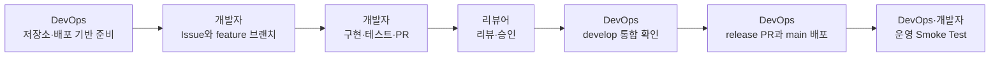

# Click HUB 팀 개발·배포 운영 가이드

이 문서는 Frontend와 Backend 개발자가 기능 개발을 시작하기 전에 필요한 준비와, 코드가 병합된 뒤 DevOps 담당자가 수행할 작업을 정리합니다.

## 1. 현재 구성

| 구분 | 구성 | 기준 브랜치 |
| --- | --- | --- |
| Frontend | Vue 3, Vite, Vercel | `main` |
| Backend | Spring Boot, Java 21, Render Docker | `main` |
| 로컬 통합 환경 | Docker Compose | 작업 브랜치 |
| 기능 통합 | GitHub Pull Request | `develop` |
| 운영 배포 | Vercel·Render 자동 배포 | `main` |

현재 저장소에는 FE/BE Dockerfile, `compose.yaml`, GitHub Actions CI, Vercel 설정, Render Blueprint와 기본 Ping API가 준비되어 있습니다. 실제 Vercel·Render 프로젝트 생성과 공개 URL 검증은 별도의 운영 작업입니다.

## 2. 전체 책임 흐름



개발자는 기능과 테스트의 완결성을 책임지고, DevOps 담당자는 브랜치 보호, CI, 환경변수, 배포 및 운영 확인을 책임집니다. API 계약이나 장애 원인처럼 양쪽 코드에 영향을 주는 문제는 FE·BE·DevOps가 함께 확인합니다.

## 3. 팀 개발 시작 전 DevOps 작업

### 3.1 최초 1회 필수 작업

- [ ] Vercel에 `click-hub-frontend` 프로젝트를 만들고 Root Directory를 `frontend`로 설정합니다.
- [ ] Render에서 저장소 루트의 `render.yaml`을 사용하는 Blueprint를 생성합니다.
- [ ] Vercel 최초 URL을 Render의 `CORS_ALLOWED_ORIGINS`에 입력합니다.
- [ ] Render URL을 Vercel의 `VITE_API_BASE_URL`에 입력하고 FE를 재배포합니다.
- [ ] Render에 충분히 긴 랜덤 값의 `CLICKHUB_JWT_SECRET`을 등록합니다.
- [ ] 공개 FE 화면, `/actuator/health`, `/api/v1/ping`, 브라우저 CORS 호출을 확인합니다.
- [ ] 확정된 운영 URL과 확인 결과를 `DEPLOYMENT.md`에 기록합니다.

환경변수의 소유권은 다음과 같습니다.

| 플랫폼 | 변수 | 값 | 관리 원칙 |
| --- | --- | --- | --- |
| Vercel | `VITE_API_BASE_URL` | Render HTTPS Origin | 공개 설정값이지만 변경 후 재배포 필요 |
| Render | `CORS_ALLOWED_ORIGINS` | Vercel HTTPS Origin | 끝의 `/` 제거, `*` 금지 |
| Render | `CLICKHUB_JWT_SECRET` | 32바이트 이상 랜덤 비밀값 | Git 커밋·메신저 공유 금지 |
| Render | `JAVA_TOOL_OPTIONS` | Blueprint 기본값 사용 | 메모리 문제 발생 시 DevOps가 조정 |
| Render | `PORT` | Render 자동 주입 | 직접 등록하지 않음 |

현재 Backend는 DB 도입 전까지 기본 `nodb` 프로필로 실행됩니다. DB를 도입할 때 DevOps 담당자는 DB 서비스, 활성 프로필, 접속 정보와 Secret 관리 방법을 별도 작업으로 준비해야 합니다.

### 3.2 저장소 보호 규칙

`main`에는 아래 조건이 필요합니다.

- Pull Request와 최소 1명 승인
- `Frontend CI`, `Backend CI`, `Container Build` 성공
- 리뷰 대화 해결
- force push와 브랜치 삭제 금지
- 관리자도 보호 규칙 우회 금지

`develop`에도 직접 push를 막고 Pull Request와 필수 CI를 적용하는 것을 권장합니다. 2026-09-03 확인 기준으로 `develop`은 아직 보호되지 않았으며, `main`의 관리자 우회 방지도 다시 활성화할 필요가 있습니다.

### 3.3 팀 공통 준비

- [ ] GitHub Issue와 Project 작업 단위를 준비합니다.
- [ ] 팀원이 저장소와 Project에 접근할 수 있는지 확인합니다.
- [ ] `CONTRIBUTING.md`의 브랜치·커밋·PR 규칙을 공지합니다.
- [ ] `.env`와 Secret은 커밋하지 않으며 예시는 `.env.example`만 사용하도록 안내합니다.
- [ ] FE·BE가 함께 바뀌는 기능은 구현 전에 URL, HTTP Method, 요청·응답 JSON, 오류 상태 코드를 합의합니다.

## 4. 팀원의 기능 개발 절차

### 4.1 작업 시작

```bash
git switch develop
git pull --ff-only origin develop
git switch -c feature/<issue-number>-<short-name>
```

기능마다 Issue 하나와 목적이 분명한 브랜치 하나를 사용합니다. `main`이나 `develop`에 직접 커밋하지 않습니다.

### 4.2 로컬 실행

전체 연결을 확인할 때는 다음 명령을 사용합니다.

```bash
docker compose up --build -d
docker compose ps
```

개별 개발 서버를 사용할 때는 다음처럼 실행합니다.

```bash
cd frontend
npm ci
npm run dev
```

```bash
cd backend
./gradlew bootRun
```

로컬 FE는 `http://localhost:5173`, BE는 `http://localhost:8080`을 기본값으로 사용합니다. 개인 포트나 로컬 Secret은 추적되지 않는 환경 파일이나 셸 환경변수로 관리합니다.

### 4.3 구현 중 지켜야 할 기준

- FE 개발자는 API 주소를 코드에 하드코딩하지 않고 `VITE_API_BASE_URL`을 사용합니다.
- BE 개발자는 API를 `/api/v1` 아래에 추가하고 필요한 CORS·Security 공개 경로를 함께 검토합니다.
- API 계약을 변경하면 FE와 BE 담당자에게 알리고 관련 테스트와 문서를 함께 수정합니다.
- 의존성을 추가하면 lockfile 또는 Gradle 설정을 함께 커밋하고 Docker 빌드 영향도 확인합니다.
- 토큰, 비밀번호, 개인 `.env`, 빌드 결과물은 커밋하지 않습니다.

### 4.4 PR 전 검증

Frontend 변경:

```bash
cd frontend
npm run test:unit -- --run
npx --no-install oxlint .
npx --no-install eslint .
npx --no-install prettier --check --experimental-cli src/
npm run build
```

Backend 변경:

```bash
cd backend
./gradlew test build --no-daemon
```

FE·BE 연결이나 배포 설정 변경:

```bash
docker compose build
docker compose up -d
curl http://localhost:8080/actuator/health
curl http://localhost:8080/api/v1/ping
docker compose down
```

### 4.5 Pull Request

- 대상 브랜치는 `develop`으로 지정합니다.
- 관련 Issue, 변경 이유, API·환경변수 변경, 검증 명령과 결과를 PR 본문에 적습니다.
- CI 실패는 작성자가 먼저 원인을 확인하고 수정합니다.
- 리뷰 의견을 반영하고 대화를 해결한 뒤 병합합니다.
- 인프라, 환경변수 또는 배포 방식이 바뀌면 DevOps 담당자를 리뷰어로 지정합니다.

## 5. 기능 PR 이후 DevOps 작업

### 5.1 `develop` 통합 확인

- [ ] 세 CI가 모두 성공했는지 확인합니다.
- [ ] Dockerfile, Compose, 포트, CORS, Secret 또는 환경변수 변경 여부를 확인합니다.
- [ ] FE와 BE가 함께 변경됐다면 로컬 통합 실행으로 핵심 사용자 흐름을 확인합니다.
- [ ] 새 환경변수는 이름, 적용 플랫폼, 공개 여부, 기본값을 문서화합니다.
- [ ] 운영 인프라 변경은 애플리케이션 코드보다 먼저 또는 동시에 준비합니다.

일반 기능 PR이 `develop`에 병합됐다고 운영 배포가 발생하지는 않습니다. 운영 배포 기준은 `main`입니다.

### 5.2 정식 릴리스

1. 최신 `develop`에서 `release/<version>` 브랜치를 만듭니다.
2. 릴리스 범위, 마이그레이션, 환경변수 및 롤백 방법을 확인합니다.
3. `release/*`에서 `main`으로 PR을 만들고 CI와 팀원 승인을 받습니다.
4. 병합 후 Vercel과 Render의 자동 배포 상태를 확인합니다.
5. 운영 Smoke Test를 통과하면 태그와 릴리스 기록을 남깁니다.
6. 릴리스 중 수정한 내용이 있다면 `develop`에도 동기화합니다.

운영 Smoke Test 최소 항목:

```bash
curl https://<render-service>.onrender.com/actuator/health
curl https://<render-service>.onrender.com/api/v1/ping
```

- [ ] Vercel 운영 URL이 HTTP 200으로 열립니다.
- [ ] Backend connection 카드가 연결 성공을 표시합니다.
- [ ] Render health가 `UP`입니다.
- [ ] Ping API가 `status=ok`, `service=click-hub-backend`를 반환합니다.
- [ ] 브라우저 요청에 운영 Vercel Origin만 CORS 허용됩니다.
- [ ] Vercel·Render 로그에 반복 오류가 없습니다.

### 5.3 장애와 롤백

- FE만 실패하면 Vercel의 직전 정상 Deployment로 롤백합니다.
- BE만 실패하면 Render의 직전 정상 배포를 재배포하고 health를 확인합니다.
- 환경변수 문제라면 값을 수정한 뒤 해당 서비스를 재배포합니다.
- API 호환성 문제라면 FE와 BE를 함께 이전 호환 버전으로 되돌립니다.
- 원인과 조치 결과는 Issue 또는 장애 기록에 남기고 후속 수정은 `hotfix/*`에서 시작합니다.
- `hotfix/*`는 `main`에 병합한 뒤 같은 변경을 `develop`에도 반영합니다.

## 6. 작업 완료 기준

### 개발자 완료 기준

- [ ] Issue 요구사항과 API 계약을 충족했습니다.
- [ ] 관련 테스트를 추가했고 로컬 검증과 CI가 통과했습니다.
- [ ] Secret이나 개인 환경 파일이 커밋되지 않았습니다.
- [ ] 변경된 실행법·API·환경변수를 문서화했습니다.
- [ ] 리뷰 대화를 모두 해결했습니다.

### DevOps 완료 기준

- [ ] 보호 브랜치와 필수 CI가 정상 작동합니다.
- [ ] 플랫폼 환경변수와 Secret이 코드 밖에서 관리됩니다.
- [ ] `main` 배포가 Vercel과 Render에서 성공했습니다.
- [ ] 공개 URL과 FE→BE 연결 Smoke Test가 통과했습니다.
- [ ] 배포 버전, 변경 내용, 장애 시 롤백 지점을 기록했습니다.

## 7. 관련 문서

- 개발 기여 규칙: `CONTRIBUTING.md`
- 배포 생성과 환경변수 설정: `DEPLOYMENT.md`
- 프로젝트 실행 방법: `README.md`
